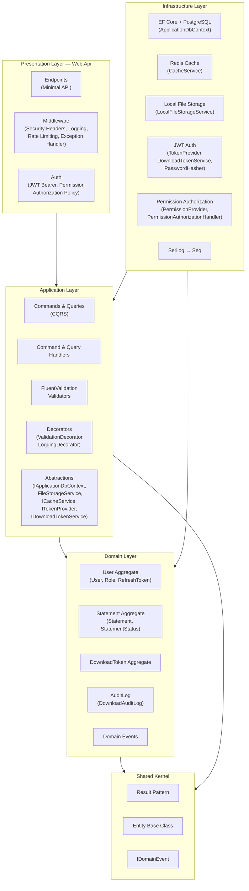
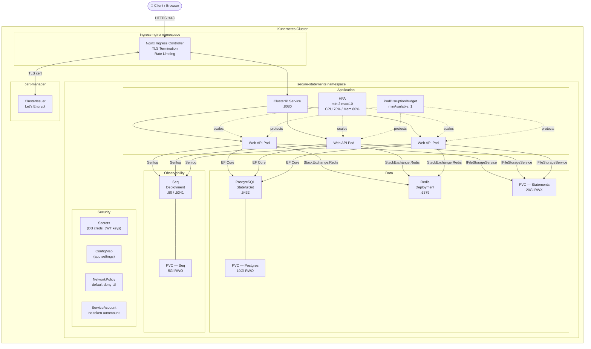
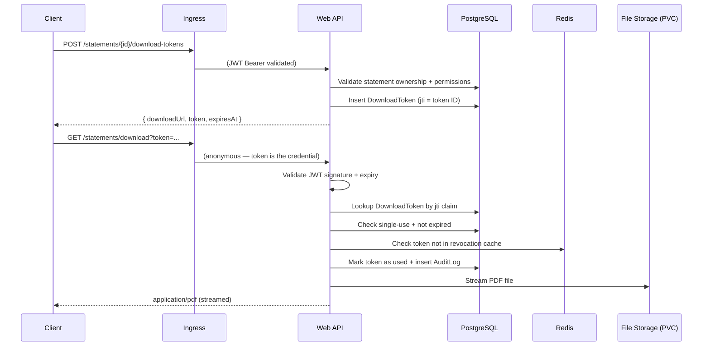

# Architecture

## Clean Architecture Layers

## Kubernetes Infrastructure

## Request Flow — Download Statement

## Security Model

| Layer | Control |
|-------|---------|
| Transport | TLS 1.2+ enforced at Ingress |
| Rate Limiting | Nginx (20 rps) + ASP.NET Core (10/min auth, 100/min API) |
| Authentication | JWT Bearer (HS256, 60-min expiry) |
| Refresh Tokens | SHA-256 hashed, 30-day expiry, rotation on use |
| Download Links | Signed JWT (`jti` = DB row ID), single-use, IP-bound |
| Authorization | Permission-based RBAC (Admin / Customer roles) |
| Network | K8s NetworkPolicy default-deny; pod-to-pod whitelist |
| Secrets | K8s Secrets (recommend Sealed Secrets / Vault in prod) |
| Container | Non-root (UID 1654), read-only filesystem, drop ALL capabilities |
| Security Headers | X-Content-Type-Options, X-Frame-Options, CSP, HSTS |
